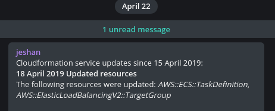

# cfn-news-to-telegram
Send Cloudformation feature releases to Telegram in a private chat on a weekly basis.

To deploy: `pipenv run bash deploy-cfn-news.sh`. This script leverages both AWS CLI and [sceptre](https://github.com/cloudreach/sceptre). (Use of sceptre is optional)

It expects the following parameters available in Systems Manager Parameter store:

- `default-sam-bucket`: The S3 bucket that AWS CLI requires to upload the packaged cloudformation template.
- `bot-token`: The bot token for your bot.
- `/cfn-news-to-telegram/chat-id`: The user or group chat ID to whom to send the events.

**Note** that you must add the bot to the group that you specified while deploying, otherwise the bot will not have permission to send you messages.
